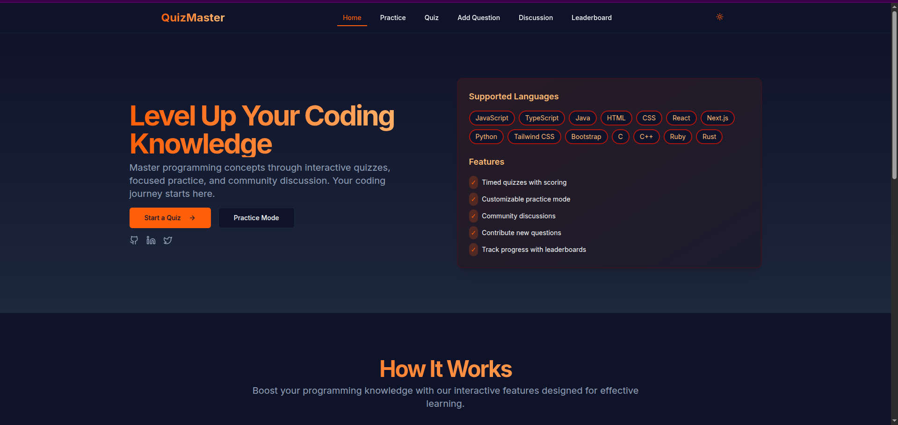
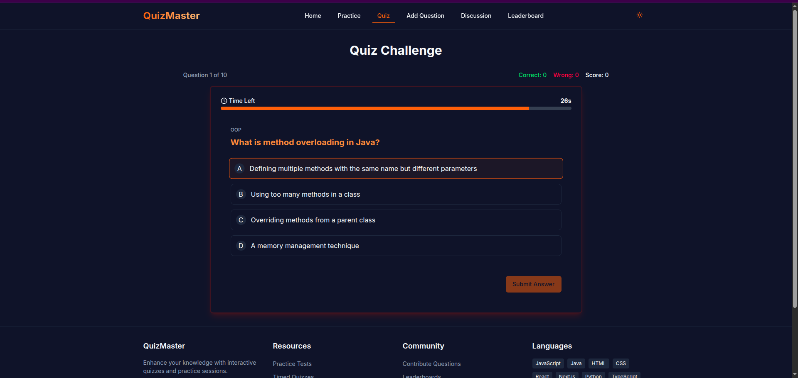
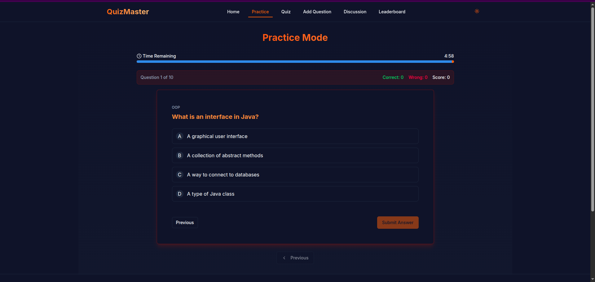

# CodeQuiz - Interactive Programming Quiz Application


## 🚀 Overview

CodeQuiz is an interactive web application designed to help developers test and improve their programming knowledge across multiple languages. With features like practice mode, timed quizzes, and a comprehensive question bank, it's the perfect tool for both learning and assessment.

## ✨ Features

- 🌐 **Multiple Programming Languages**
  - JavaScript
  - Python
  - Java
  - HTML
  - CSS
  - React
  - Next.js
  - TypeScript
  - And more...

- 📝 **Quiz Modes**
  - Quick Quiz Mode
  - Practice Mode with customizable settings
  - Timed challenges
  - Instant feedback on answers

- 🎯 **Key Features**
  - Real-time scoring
  - Detailed explanations for answers
  - Progress tracking
  - Performance analytics
  - Leaderboard system
  - Mobile-responsive design

## 🛠️ Tech Stack

- React
- TypeScript
- Tailwind CSS
- Vite
- React Router
- React Query
- Shadcn/ui Components

## 📸 Screenshots

### Home Page


### Quiz Interface


### Practice Mode


### Results Summary


## 🚀 Getting Started

1. **Clone the repository**
```bash
git clone https://github.com/Vegadjay/quiz-app.git
cd quiz-app
```

2. **Install dependencies**
```bash
npm install
```

3. **Start the development server**
```bash
npm run dev
```

4. **Build for production**
```bash
npm run build
```

## 🌟 Usage

1. Select your preferred programming language
2. Choose between Quiz or Practice mode
3. Answer questions within the time limit
4. Get instant feedback and explanations
5. View your results and track your progress

## 📁 Project Structure

```
quiz-app/
├── src/
│   ├── components/
│   │   ├── layout/
│   │   ├── quiz/
│   │   └── ui/
│   ├── pages/
│   ├── utils/
│   ├── hooks/
│   └── data/
├── public/
└── ...
```

## 🤝 Contributing

Contributions are welcome! Please feel free to submit a Pull Request.

1. Fork the repository
2. Create your feature branch (`git checkout -b feature/AmazingFeature`)
3. Commit your changes (`git commit -m 'Add some AmazingFeature'`)
4. Push to the branch (`git push origin feature/AmazingFeature`)
5. Open a Pull Request

## 📝 License

This project is licensed under the MIT License - see the [LICENSE](LICENSE) file for details.

## 🙏 Acknowledgments

- Thanks to all contributors who have helped make this project better
- Special thanks to the open-source community for the amazing tools and libraries

## 📞 Contact

Your Name - [@yourtwitter](https://twitter.com/yourtwitter)

Project Link: [https://github.com/Vegadjay/quiz-app](https://github.com/Vegadjay/quiz-app)

---

⭐️ If you found this project helpful, please give it a star!